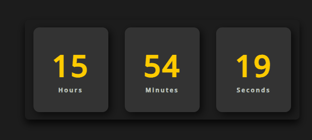

  <h1>Relógio Digital</h1>
  

## Descrição

Este projeto consiste em um relógio digital simples desenvolvido em HTML, CSS e JavaScript. Exibe as horas, minutos e segundos atualizados em tempo real.

## Tecnologias

- HTML
- CSS
- JavaScript

## Como usar

1. Faça o clone deste repositório: `git clone https://github.com/seu-usuario/nome-do-repositorio.git`
2. Abra o arquivo `index.html` em seu navegador.
3. O relógio irá mostrar as horas, minutos e segundos atuais.
4. O conteúdo é atualizado automaticamente em tempo real.

---

Espero que isso atenda às suas expectativas! Se precisar de mais alguma coisa ou quiser fazer ajustes, estou à disposição.
